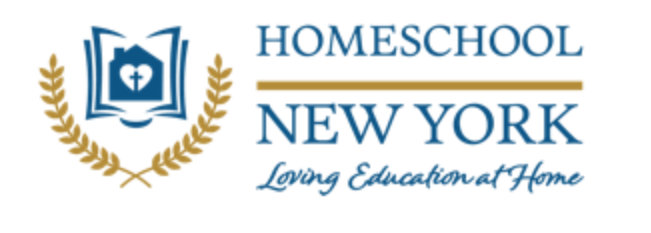

### Who are we?

The Oswego Homeschool Association is a non-profit group for homeschooling parents and children of all ages. We believe that parents are the primary teachers and are responsible for all lawful reporting, curricula choices, and core subject instruction. OHA aims to support the role of the parent by offering meetings, special events, field trips, and educational opportunities. We are an inclusive, eclectic, local, member-run organization that honors the diversity of homeschoolers and provides a supportive community for our members. Our reasons for homeschooling differ, as do our styles and approaches to education. What we share is a respect for all learners and a desire to support one another.

### What we offer?

OHA is very happy to provide a broad range of extracurricular and supplemental activies to Oswego's homeschool community. As an OHA member, your child can participate in our Lakeside Enrichment and Academic Program (LEAP), choir, theatrical performances, ROYALS athletics, and more. Our programs are ever changing and we are always looking for ways to enrich our children's lives.

If you are interested in becoming an OHA member, feel free to email us at **(oswegohamembership@gmail.com)** for more information. When you are ready to join, simply click "Join" above to fill out an application.

### LEAH

OHA is a chapter of Homeschool NY/Loving Education at Home, Inc. In becoming an OHA member, you are also a member of Homeschool NY/Loving Education at Home, Inc. For more information about Homeschool NY/Loving Education at Home, Inc, please click the button below!

